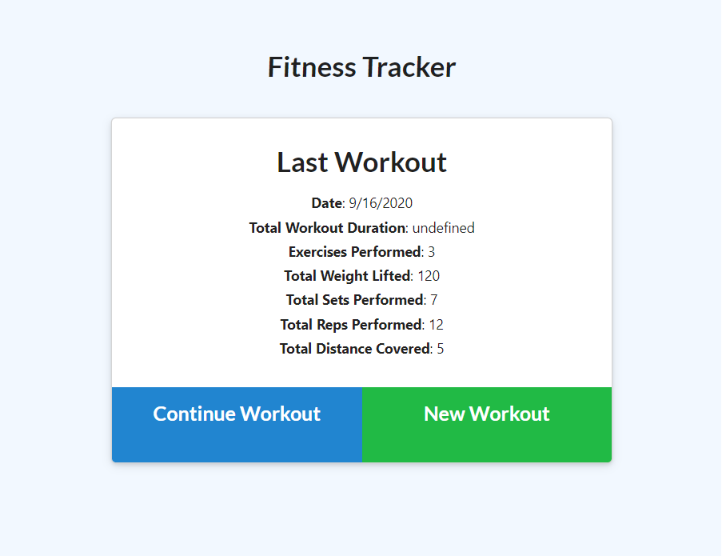

# Workout-Tracker    
        
## Live Page [workout-tracker](https://evening-falls-68356.herokuapp.com/)

## Screenshot

                                 

## Description
This application helps keep track of daily workouts, and logs multiple excercises in a full workout session. It logs the type of workout, weight, sets, reps and duration of the exercise as well as the distance traveled if the cardie exercise option is chosen.

## Table of Contents
* [Installation](#Installation-Guide)
* [Usage](#Usage)
* [Contributors](#Contributors)
* [Contact-Information](#contact-Information)

## Installation Guide
Download this repo for modifications or just visit the link above for use.
        
## Usage
Simply fill out the form provided in the home page.
        
## Contributors
Jesus Rios

## Contact Information
Github Username - [JesusFernandoRios](http://github.com/JesusFernandoRios)

E-mail - jesusfernandorios@outlook.com
